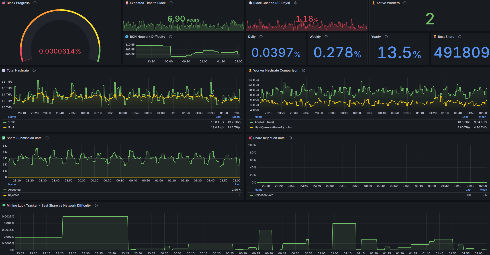

# Solomining.io Prometheus Exporter

[-blue.svg)](LICENSE)
[](https://hub.docker.com/r/clanktechstudio/solomining.io-dashboard)



A Prometheus exporter for [solomining.io](https://bchnode.solomining.io) mining pool statistics. Works with any coin supported by solomining.io (BCH, BTC, LTC, and more). This exporter fetches mining data and exposes it in Prometheus format for monitoring and visualization with Grafana.

## ⚡ Fastest Setup - Automated Installation

**Get everything running with one command:**

```bash
curl -sSL https://raw.githubusercontent.com/Clankcoll/solomining.io-dashboard/main/setup.sh | bash
```

This automated script will:
1. Download all necessary files (docker-compose, configs, dashboards)
2. Create the directory structure
3. Prompt for your mining address
4. Optionally set a custom Grafana password
5. Start all services (Prometheus + Grafana + Exporter)
6. Display access URLs and credentials

**That's it!** Your dashboard will be ready at http://localhost:3000 (admin/admin)

---

## 🚀 Full-Stack Quick Start (Manual Installation)

**Complete monitoring solution in 3 easy steps!** Includes Prometheus, Grafana, and the exporter pre-configured.

### 1. Get the Repository
```bash
git clone https://github.com/Clankcoll/solomining.io-dashboard.git
cd solomining.io-dashboard
```

### 2. Configure Your BCH Address
```bash
# Copy the example environment file
cp .env.example .env

# Edit and add your BCH address
nano .env
# Change: BCH_ADDRESS=bitcoincash:YOUR_ADDRESS_HERE
```

### 3. Start the Stack
```bash
# Start all services (Prometheus + Grafana + Exporter)
docker-compose -f docker-compose.full-stack.yml up -d

# View logs to ensure everything is running
docker-compose -f docker-compose.full-stack.yml logs -f
```

### 4. Access Grafana Dashboard
Open your browser and navigate to:
- **URL**: http://localhost:3000 (or http://your-server-ip:3000)
- **Username**: `admin`
- **Password**: `admin` (change this after first login!)

**The dashboard is already loaded and showing your mining statistics!** 🎉

### Services Running
- **Grafana**: http://localhost:3000 - Dashboard interface
- **Prometheus**: http://localhost:9090 - Metrics database
- **Exporter**: http://localhost:9123/metrics - Raw metrics endpoint

### Data Persistence
Your metrics and Grafana settings are automatically saved in Docker volumes and will persist across restarts.

---

## Advanced: Manual Setup

If you already have Prometheus and Grafana running, or want to customize the setup, you have multiple options:

**Choose your deployment method:**
- **Option 1**: Use `docker-compose.yml` (exporter only) - See below
- **Option 2**: Use `docker run` command - See [Features](#features) section
- **Option 3**: Manual installation with custom Prometheus/Grafana - See [Prometheus Configuration](#prometheus-configuration)

## Quick Start Guide - Exporter Only (docker-compose.yml)

### Step 1: Get the docker-compose.yml File

**Option A: Download directly**
```bash
# Download just the docker-compose.yml file
wget https://raw.githubusercontent.com/Clankcoll/solomining.io-dashboard/main/docker-compose.yml

# Or using curl:
curl -O https://raw.githubusercontent.com/Clankcoll/solomining.io-dashboard/main/docker-compose.yml
```

**Option B: Clone entire repository**
```bash
git clone https://github.com/Clankcoll/solomining.io-dashboard.git
cd dataexporter-solomining.io
```

### Step 2: Configure and Run

1. **Edit your mining address**:
   ```bash
   nano docker-compose.yml
   # Change the BCH_ADDRESS line to your address
   ```

2. **Login to registry** (if needed):
   ```bash
   # No login needed for Docker Hub public images
   # Enter your credentials if prompted
   ```

3. **Start the exporter**:
   ```bash
   docker-compose up -d
   ```

4. **Verify it's working**:
   ```bash
   # Check the logs
   docker-compose logs -f

   # Test the metrics endpoint (press Ctrl+C to exit logs first)
   curl http://localhost:9123/metrics
   ```

### Step 3: Configure Prometheus

Add this to your Prometheus `prometheus.yml` file:

```yaml
scrape_configs:
  - job_name: 'solomining'
    static_configs:
      - targets: ['<your-server-ip>:9123']  # Replace with your server IP
    scrape_interval: 60s
```

Then reload Prometheus:
```bash
curl -X POST http://your-prometheus-ip:9090/-/reload
```

### Step 4: Import Grafana Dashboard

1. **Download the dashboard file**:
   ```bash
   wget https://raw.githubusercontent.com/Clankcoll/solomining.io-dashboard/main/grafana/dashboards/solomining-dashboard.json
   ```

2. **Open Grafana** in your browser: `http://your-grafana-ip:3000`

3. **Import the dashboard**:
   - Click the **+** icon in the left sidebar
   - Select **Import**
   - Click **Upload JSON file**
   - Select the `solomining-dashboard.json` file
   - Select your **Prometheus** data source from the dropdown
   - Click **Import**

4. **Done!** Your dashboard should now display your solomining.io statistics with:
   - Block progress percentage
   - Expected time to block
   - Block finding probabilities
   - Hashrate metrics
   - Worker statistics
   - And more!

---

## Features

- **Account Metrics**: Total hashrate, worker count, accepted/rejected shares, best share difficulty
- **Worker Metrics**: Per-worker hashrate, shares, and performance statistics
- **Time-based Hashrate**: 1-minute, 5-minute, 1-hour, 1-day, and 7-day averages
- **Health Monitoring**: Built-in scrape success and duration metrics
- **Dockerized**: Ready to deploy via Docker Compose

## Quick Start

### Prerequisites

- Docker and Docker Compose installed
- Prometheus instance for scraping metrics
- (Optional) Grafana for visualization

### Deployment

1. **Clone the repository:**
   ```bash
   git clone https://github.com/Clankcoll/solomining.io-dashboard.git
   cd dataexporter-solomining.io
   ```

2. **Configure your Bitcoin Cash address** (optional):

   Edit `docker-compose.yml` and update the `BCH_ADDRESS` environment variable:
   ```yaml
   environment:
     - BCH_ADDRESS=bitcoincash:your_address_here
   ```

3. **Login to GitLab Container Registry** (if authentication is required):
   ```bash
   # No login needed for Docker Hub public images
   # Enter your GitLab username and password or access token
   ```

4. **Pull and start the exporter:**
   ```bash
   docker-compose pull  # Pull latest image from registry
   docker-compose up -d # Start the exporter
   ```

5. **Verify it's running:**
   ```bash
   # Check logs
   docker-compose logs -f

   # Test metrics endpoint
   curl http://localhost:9123/metrics
   ```

### Updating to Latest Version

The project uses GitLab CI/CD to automatically build Docker images on every commit to the `main` branch.

To update to the latest version:

```bash
cd dataexporter-solomining.io
git pull                 # Get latest code
docker-compose pull      # Pull latest Docker image
docker-compose up -d     # Restart with new image
```

### Configure Prometheus

Add the following scrape configuration to your `prometheus.yml`:

```yaml
scrape_configs:
  - job_name: 'solomining'
    static_configs:
      - targets: ['<exporter-host>:9123']
    scrape_interval: 60s
```

Replace `<exporter-host>` with the IP address or hostname where the exporter is running.

Reload Prometheus configuration:
```bash
curl -X POST http://localhost:9090/-/reload
```

## Configuration

Environment variables in `docker-compose.yml`:

| Variable | Default | Description |
|----------|---------|-------------|
| `SCRAPE_INTERVAL` | `60` | How often to fetch data (seconds) |
| `EXPORTER_PORT` | `9123` | Port to expose metrics |
| `BCH_ADDRESS` | `bitcoincash:qpws...` | Bitcoin Cash address to monitor |
| `BASE_URL` | `https://bchnode.solomining.io/address.php` | Mining pool API endpoint |

## Exposed Metrics

### Account Metrics

- `solomining_account_hashrate{timeframe}` - Account hashrate in hashes/second
- `solomining_account_workers` - Number of active workers
- `solomining_account_shares_accepted_total` - Total accepted shares
- `solomining_account_shares_rejected_total` - Total rejected shares
- `solomining_account_best_share_difficulty` - Best share difficulty
- `solomining_account_last_update_timestamp` - Last update timestamp

### Worker Metrics

- `solomining_worker_hashrate{worker,timeframe}` - Per-worker hashrate
- `solomining_worker_shares_accepted_total{worker}` - Per-worker accepted shares
- `solomining_worker_shares_rejected_total{worker}` - Per-worker rejected shares
- `solomining_worker_last_share_timestamp{worker}` - Per-worker last share time

### Exporter Health

- `solomining_scrape_success` - Whether last scrape succeeded (1=success, 0=failure)
- `solomining_scrape_duration_seconds` - Time taken for last scrape

### BCH Network and Block Finding Metrics

- `bch_network_difficulty` - Current BCH network difficulty (fetched from Blockchair API)
- `solomining_block_progress_percent` - How close your best share is to finding a block (best_share / network_difficulty × 100)
- `solomining_expected_time_to_block_seconds` - Expected time to find a block based on your hashrate
- `solomining_block_chance_daily` - Probability of finding a block within 24 hours (0-1)
- `solomining_block_chance_weekly` - Probability of finding a block within 7 days (0-1)
- `solomining_block_chance_monthly` - Probability of finding a block within 30 days (0-1)
- `solomining_block_chance_yearly` - Probability of finding a block within 365 days (0-1)

#### Understanding Block Finding Metrics

**Expected Time to Block (ETB):**
```
ETB = (difficulty × 2^32) / hashrate
```

**Block Chance Calculation:**
Uses Poisson distribution: `Chance = 1 - e^(-time_period / ETB)`

**Block Progress:**
Shows how close you were to finding a block: `(best_share / network_difficulty) × 100`
- If you reach 100% or higher, you found a block! 🎉
- Example: 0.0009% means you're still far from a block
- Example: 85% means you were very close!

## Example Grafana Queries

```promql
# Current total hashrate (1-minute average)
solomining_account_hashrate{timeframe="1min"}

# Total shares accepted over time
rate(solomining_account_shares_accepted_total[5m])

# Worker hashrate comparison
solomining_worker_hashrate{timeframe="1min"}

# Rejection rate
rate(solomining_account_shares_rejected_total[5m]) / rate(solomining_account_shares_accepted_total[5m])

# Scrape success rate
avg_over_time(solomining_scrape_success[5m])

# === Block Finding Metrics ===

# BCH network difficulty
bch_network_difficulty

# How close to finding a block (%)
solomining_block_progress_percent

# Expected time to block (in days)
solomining_expected_time_to_block_seconds / 86400

# Block chance this month (as %)
solomining_block_chance_monthly * 100

# Block chance this year (as %)
solomining_block_chance_yearly * 100

# Gauge: "How lucky would I need to be?" - Shows best share vs difficulty
(solomining_account_best_share_difficulty / bch_network_difficulty) * 100
```

### Popular Dashboard Panels

**1. Block Progress Gauge:**
- Query: `solomining_block_progress_percent`
- Visualization: Gauge (0-100%)
- Description: Shows how close your best share is to finding a block

**2. Expected Time to Block:**
- Query: `solomining_expected_time_to_block_seconds / 86400`
- Visualization: Stat panel
- Unit: Days
- Description: Statistical average time until you find a block

**3. Block Chances:**
- Query: `solomining_block_chance_monthly * 100`
- Visualization: Stat panel
- Unit: Percent
- Description: Your probability of finding a block this month

**4. Mining Luck Tracker:**
- Query: `(solomining_account_best_share_difficulty / bch_network_difficulty) * 100`
- Visualization: Time series graph
- Description: Track your best shares over time relative to network difficulty

## Monitoring Multiple Addresses

To monitor multiple Bitcoin Cash addresses, run multiple instances:

```yaml
version: '3.8'

services:
  solomining-exporter-address1:
    image: clanktechstudio/solomining.io-dashboard:latest
    container_name: solomining-exporter-address1
    restart: unless-stopped
    ports:
      - "9123:9123"
    environment:
      - BCH_ADDRESS=bitcoincash:address1

  solomining-exporter-address2:
    image: clanktechstudio/solomining.io-dashboard:latest
    container_name: solomining-exporter-address2
    restart: unless-stopped
    ports:
      - "9124:9123"
    environment:
      - BCH_ADDRESS=bitcoincash:address2
```

## Troubleshooting

### Cannot pull image from registry

If you get authentication errors when pulling the image:

```bash
# Login to the GitLab Container Registry
# No login needed for Docker Hub public images

# Username: Your GitLab username
# Password: Your GitLab password or personal access token
```

If authentication still fails:
- Verify you have access to the repository
- Check if the registry URL is correct
- Try using a personal access token instead of password

### Exporter not starting

```bash
# Check logs
docker-compose logs

# Check if port is already in use
netstat -tuln | grep 9123
```

### No metrics appearing in Prometheus

1. Verify exporter is accessible: `curl http://<exporter-host>:9123/metrics`
2. Check Prometheus targets: `http://<prometheus>:9090/targets`
3. Verify firewall rules allow port 9123

### Scrape failures

Check the `solomining_scrape_success` metric. If it's 0, check:
- Network connectivity to solomining.io
- DNS resolution
- Exporter logs: `docker-compose logs -f`


## License

This project uses a **Dual License** model for the **exporter code only**.

### 👤 Personal Use - FREE
Free for individuals and personal mining operations. Use it for your own monitoring without any fees.

### 🏢 Commercial Use - License Required
Businesses, corporations, and commercial entities must obtain a commercial license.

**Need a commercial license?** Contact: info@clank.tech

### Third-Party Components
When using the full stack (Prometheus + Grafana):
- **Prometheus**: Apache 2.0 License (permissive, free for all use)
- **Grafana OSS**: AGPL v3 License (open source, see [Grafana licensing](https://grafana.com/licensing/))

The dual license applies only to this exporter. Third-party components retain their respective licenses.

See the [LICENSE](LICENSE) file for full details.

## Contributing

Found a bug or have a feature request? Feel free to reach out!

For commercial support or custom features, contact: info@clank.tech
